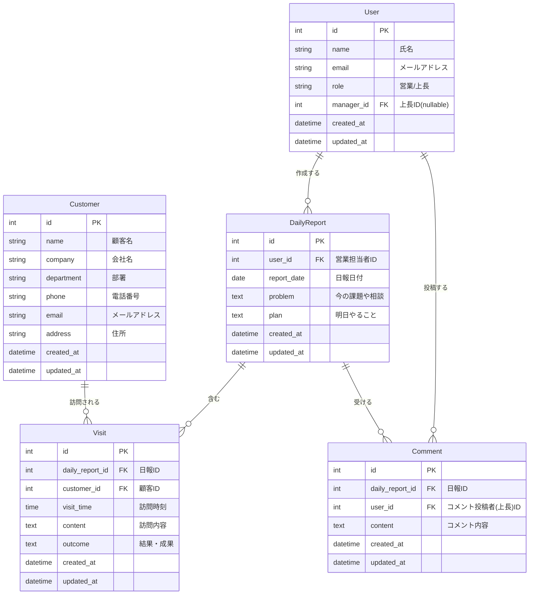

## 要件定義

### 1. システム概要

営業担当者が日々の活動を報告し、上長がフィードバックを行うための日報管理システム。

### 2. 主要エンティティ

**営業マスタ (User/Sales)**

- 営業担当者と上長の情報を管理
- 役割（営業/上長）を識別

**顧客マスタ (Customer)**

- 訪問対象となる顧客情報を管理
- 営業活動の基礎データ

**日報 (DailyReport)**

- 1営業担当者につき1日1件
- その日の総括情報（Problem/Plan）を記録

**訪問記録 (Visit)**

- 日報に紐づく個別の顧客訪問記録
- 1日に複数の訪問を記録可能

**コメント (Comment)**

- 上長が日報のProblem/Planに対してフィードバック

### 3. 主要機能

**営業担当者**

- 日報作成・編集
- 訪問記録の追加・編集・削除
- Problem/Planの記入
- 上長コメントの閲覧

**上長**

- 部下の日報閲覧
- Problem/Planへのコメント追加・編集
- 営業活動の傾向分析

### 4. ビジネスルール

- 日報は営業担当者×日付でユニーク
- 訪問記録は必ず日報に紐づく
- コメントは上長のみが作成可能
- 顧客・営業情報は事前にマスタ登録が必要

## ER図

## 補足事項

### 制約・インデックス

- `DailyReport`: `(user_id, report_date)` にユニーク制約
- `User.manager_id`: 自己参照外部キー（上長も同じUserテーブル）
- 各種検索用インデックス推奨

### 拡張検討事項

- 訪問記録に「アポ有無」「同行者」などの追加属性
- 日報のステータス（下書き/提出済/承認済）
- 顧客の担当営業（複数担当の場合）
- 添付ファイル機能（訪問時の資料など）

## 画面設計

@SCREEN_DESIGN.md

## API仕様書

@API_SPECIFICATION.md

## テスト仕様書

@TEST_SPECIFICATION.md

# 使用技術

**言語** TypeScript

**フレームワーク** Next.js (App Router)

**UIコンポーネント** shadcn/ui+Tailwind CSS

**APIスキーマ定義** OpenAPI (Zodによる検証)

**DBスキーマ定義** Prisma.js

**テスト** Vitest

**デプロイ** Google Cloud Run
