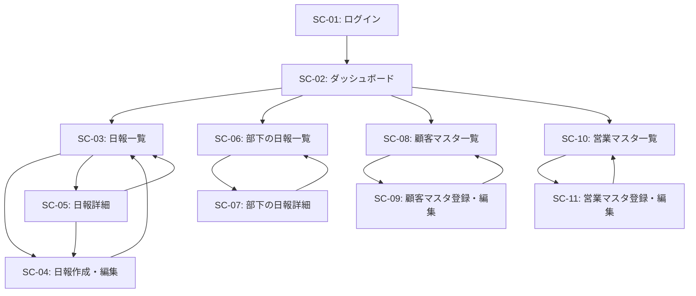

# 画面定義書

## 1. 共通仕様

### 1.1 ヘッダー（全画面共通）

- ロゴ・システム名
- ログインユーザー名・役割表示
- ナビゲーションメニュー
  - 日報一覧
  - 顧客マスタ（営業のみ）
  - 部下の日報（上長のみ）
  - 営業マスタ（管理者のみ）
- ログアウトボタン

### 1.2 レスポンシブ対応

- スマートフォン、タブレット、PCに対応
- モバイルではハンバーガーメニュー化

---

## 2. 画面一覧

| 画面ID | 画面名               | 対象ユーザー     | 備考                 |
| ------ | -------------------- | ---------------- | -------------------- |
| SC-01  | ログイン画面         | 全員             |                      |
| SC-02  | ダッシュボード       | 全員             | ログイン後の初期画面 |
| SC-03  | 日報一覧（自分）     | 営業担当者       |                      |
| SC-04  | 日報作成・編集       | 営業担当者       |                      |
| SC-05  | 日報詳細（自分）     | 営業担当者       | コメント閲覧         |
| SC-06  | 部下の日報一覧       | 上長             |                      |
| SC-07  | 部下の日報詳細       | 上長             | コメント投稿・編集   |
| SC-08  | 顧客マスタ一覧       | 営業担当者・上長 |                      |
| SC-09  | 顧客マスタ登録・編集 | 営業担当者・上長 |                      |
| SC-10  | 営業マスタ一覧       | 管理者           |                      |
| SC-11  | 営業マスタ登録・編集 | 管理者           |                      |

---

## 3. 画面詳細

### SC-01: ログイン画面

**概要**: システムへのログイン

**アクセス権限**: 未ログインユーザー

**表示項目**:

- システム名・ロゴ
- メールアドレス入力欄
- パスワード入力欄
- ログインボタン

**操作**:

- ログイン実行
- エラー時はエラーメッセージ表示

**画面遷移**:

- 成功 → SC-02（ダッシュボード）

---

### SC-02: ダッシュボード

**概要**: ログイン後の初期画面、当日の活動サマリー表示

**アクセス権限**: 全ユーザー

**表示項目（営業担当者）**:

- 本日の日報ステータス（未作成/作成済）
- 本日の訪問予定件数
- 今週の日報提出状況（カレンダービュー）
- 最近の上長コメント（最新3件）
- クイックアクションボタン
  - 今日の日報を作成/編集
  - 顧客マスタを見る

**表示項目（上長）**:

- 本日の部下の日報提出状況（一覧）
- 未コメントの日報件数
- 今週の部下の活動サマリー（訪問件数等）
- クイックアクションボタン
  - 部下の日報一覧へ
  - 未コメント日報へ

**画面遷移**:

- 各クイックアクションから対応画面へ

---

### SC-03: 日報一覧（自分）

**概要**: 自分の日報の一覧表示

**アクセス権限**: 営業担当者

**表示項目**:

- 期間絞り込み（今週/今月/カスタム期間）
- 日報一覧テーブル
  - 日付
  - 訪問件数
  - コメント有無・件数
  - 作成日時
  - 編集ボタン
  - 詳細ボタン
- ページネーション
- 新規作成ボタン（当日の日報が未作成の場合のみ）

**操作**:

- 日報の絞り込み
- 日報作成（SC-04へ）
- 日報編集（SC-04へ）
- 日報詳細（SC-05へ）

**画面遷移**:

- 新規作成/編集 → SC-04
- 詳細 → SC-05

---

### SC-04: 日報作成・編集

**概要**: 日報の新規作成または編集

**アクセス権限**: 営業担当者

**表示項目**:

- 日報日付（新規作成時は当日、編集時は表示のみ）
- 訪問記録セクション
  - 訪問記録追加ボタン
  - 訪問記録リスト（複数）
    - 顧客選択（ドロップダウン）
    - 訪問時刻（時刻入力）
    - 訪問内容（テキストエリア）
    - 結果・成果（テキストエリア）
    - 削除ボタン
- Problem（今の課題や相談）（テキストエリア）
- Plan（明日やること）（テキストエリア）
- 保存ボタン
- キャンセルボタン

**入力検証**:

- 日付: 必須
- 訪問記録: 0件以上
- Problem: 任意（推奨）
- Plan: 任意（推奨）

**操作**:

- 訪問記録の追加・削除
- 日報の保存
- キャンセル

**画面遷移**:

- 保存成功 → SC-03（日報一覧）
- キャンセル → SC-03

---

### SC-05: 日報詳細（自分）

**概要**: 自分の日報を詳細表示、上長コメント閲覧

**アクセス権限**: 営業担当者

**表示項目**:

- 日報日付
- 訪問記録一覧
  - 訪問時刻
  - 顧客名
  - 訪問内容
  - 結果・成果
- Problem（今の課題や相談）
- Plan（明日やること）
- 上長コメント一覧
  - コメント投稿者名
  - コメント内容
  - 投稿日時
- 編集ボタン
- 戻るボタン

**操作**:

- 日報編集（SC-04へ）
- 一覧へ戻る

**画面遷移**:

- 編集 → SC-04
- 戻る → SC-03

---

### SC-06: 部下の日報一覧

**概要**: 部下の日報を一覧表示

**アクセス権限**: 上長

**表示項目**:

- 部下選択（ドロップダウン、全部下/個別選択）
- 期間絞り込み（今週/今月/カスタム期間）
- 日報一覧テーブル
  - 日付
  - 営業担当者名
  - 訪問件数
  - Problem有無（アイコン）
  - Plan有無（アイコン）
  - 自分のコメント有無・件数
  - 詳細ボタン
- ページネーション

**操作**:

- 部下・期間の絞り込み
- 日報詳細（SC-07へ）

**画面遷移**:

- 詳細 → SC-07

---

### SC-07: 部下の日報詳細

**概要**: 部下の日報詳細表示とコメント投稿

**アクセス権限**: 上長

**表示項目**:

- 日報日付
- 営業担当者名
- 訪問記録一覧
  - 訪問時刻
  - 顧客名
  - 訪問内容
  - 結果・成果
- Problem（今の課題や相談）
  - コメント追加ボタン（Problemが存在する場合）
- Plan（明日やること）
  - コメント追加ボタン（Planが存在する場合）
- コメント一覧
  - コメント投稿者名
  - コメント内容
  - 投稿日時
  - 編集ボタン（自分のコメントのみ）
  - 削除ボタン（自分のコメントのみ）
- コメント入力エリア
  - コメント内容（テキストエリア）
  - 投稿ボタン
- 戻るボタン

**操作**:

- コメント投稿
- コメント編集・削除（自分のコメントのみ）
- 一覧へ戻る

**画面遷移**:

- 戻る → SC-06

---

### SC-08: 顧客マスタ一覧

**概要**: 顧客情報の一覧表示

**アクセス権限**: 営業担当者・上長

**表示項目**:

- 検索フォーム
  - 顧客名検索
  - 会社名検索
- 顧客一覧テーブル
  - 顧客名
  - 会社名
  - 部署
  - 電話番号
  - メールアドレス
  - 編集ボタン
- ページネーション
- 新規登録ボタン

**操作**:

- 顧客検索
- 顧客新規登録（SC-09へ）
- 顧客編集（SC-09へ）

**画面遷移**:

- 新規登録/編集 → SC-09

---

### SC-09: 顧客マスタ登録・編集

**概要**: 顧客情報の登録・編集

**アクセス権限**: 営業担当者・上長

**表示項目**:

- 顧客名（必須）
- 会社名（必須）
- 部署
- 電話番号
- メールアドレス
- 住所
- 保存ボタン
- キャンセルボタン

**入力検証**:

- 顧客名: 必須、最大100文字
- 会社名: 必須、最大100文字
- 電話番号: 形式チェック
- メールアドレス: 形式チェック

**操作**:

- 顧客情報の保存
- キャンセル

**画面遷移**:

- 保存成功 → SC-08
- キャンセル → SC-08

---

### SC-10: 営業マスタ一覧

**概要**: 営業担当者・上長の一覧表示

**アクセス権限**: 管理者

**表示項目**:

- 検索フォーム
  - 氏名検索
  - 役割絞り込み（営業/上長）
- 営業マスタ一覧テーブル
  - 氏名
  - メールアドレス
  - 役割
  - 上長名
  - 編集ボタン
- ページネーション
- 新規登録ボタン

**操作**:

- 営業検索
- 営業新規登録（SC-11へ）
- 営業編集（SC-11へ）

**画面遷移**:

- 新規登録/編集 → SC-11

---

### SC-11: 営業マスタ登録・編集

**概要**: 営業担当者・上長の登録・編集

**アクセス権限**: 管理者

**表示項目**:

- 氏名（必須）
- メールアドレス（必須）
- パスワード（新規登録時必須、編集時は変更する場合のみ）
- 役割（営業/上長）（必須）
- 上長選択（ドロップダウン、役割が営業の場合のみ）
- 保存ボタン
- キャンセルボタン

**入力検証**:

- 氏名: 必須、最大100文字
- メールアドレス: 必須、形式チェック、重複チェック
- パスワード: 新規登録時必須、最小8文字
- 役割: 必須
- 上長: 役割が営業の場合は必須

**操作**:

- 営業情報の保存
- キャンセル

**画面遷移**:

- 保存成功 → SC-10
- キャンセル → SC-10

---

## 4. 画面遷移図

---

## 5. 非機能要件

### 5.1 パフォーマンス

- ページ遷移: 2秒以内
- 検索結果表示: 3秒以内

### 5.2 セキュリティ

- HTTPSによる通信暗号化
- セッション管理（タイムアウト: 30分）
- CSRF対策
- SQLインジェクション対策
- XSS対策

### 5.3 ユーザビリティ

- 直感的な操作
- エラーメッセージは具体的に
- 保存前の確認ダイアログ（重要操作時）
- ローディング表示

### 5.4 ブラウザ対応

- Chrome（最新版）
- Firefox（最新版）
- Safari（最新版）
- Edge（最新版）

---

## 6. 補足事項

### 6.1 今後の拡張案

- 日報のステータス管理（下書き/提出済/承認済）
- 日報テンプレート機能
- 統計・分析ダッシュボード（上長向け）
- 通知機能（コメント投稿時など）
- エクスポート機能（PDF/Excel）
- 訪問予定管理機能
- モバイルアプリ化

### 6.2 デザインガイドライン

- カラースキーム: 企業ブランドに準拠
- フォント: 視認性の高いゴシック体
- ボタン: プライマリ/セカンダリの明確な区別
- フォームバリデーション: リアルタイムフィードバック
